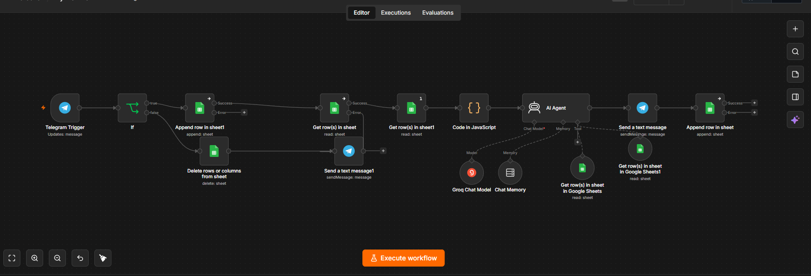
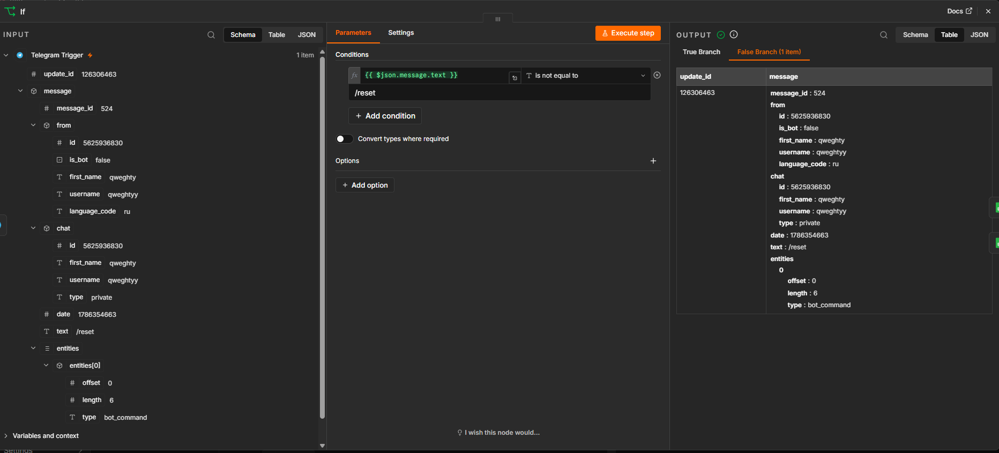
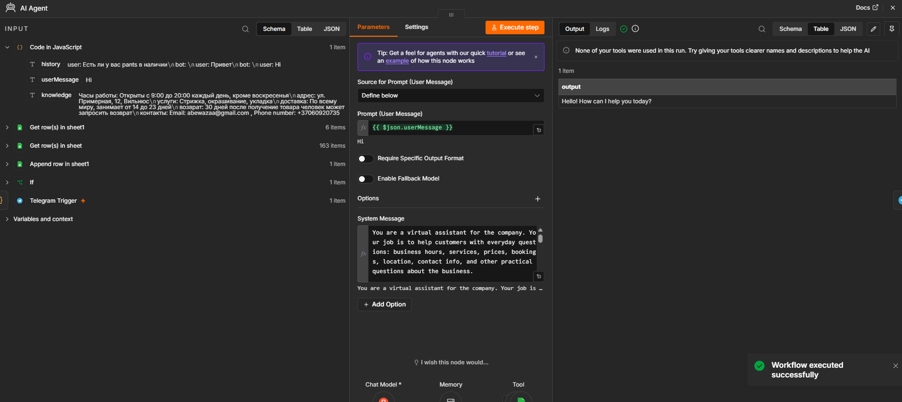
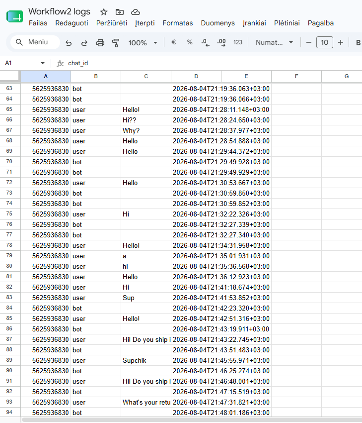
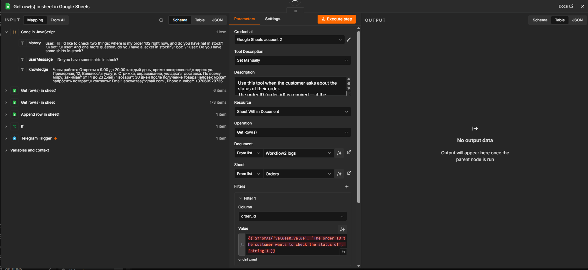
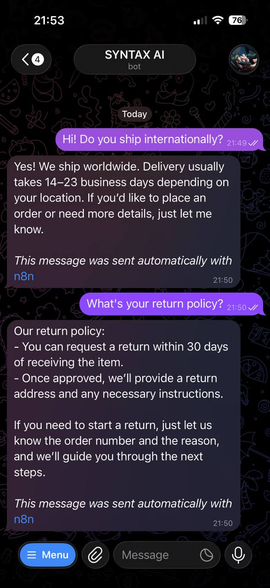
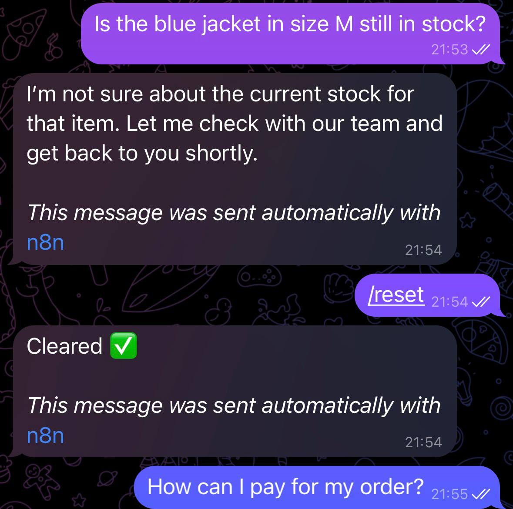

[README.md](https://github.com/user-attachments/files/30893919/README.md)
# SYNTAX AI — Shop Assistant

**An automated Telegram chatbot with long-term memory, a knowledge base, and error handling — built with n8n and the Groq LLM**

---

## The Problem

Build a Telegram bot that can take over part of a support team's workload: answering customers' everyday questions (shipping, payment, returns, product availability) quickly, around the clock, in the customer's own language, without human involvement.

## The Core Problem It Solves

Most simple AI bots lose their memory after a server restart and don't ground their answers in up-to-date business facts — they answer "from imagination," which leads to hallucinations and inaccurate information. This bot solves both problems.

## Features

- **Natural-language conversation** — customers write questions the way they'd talk to a person, and the bot understands context and answers directly
- **Automatic language detection** — the bot replies in whatever language the customer writes in, with no manual configuration
- **Long-term memory** — chat history is stored in Google Sheets and survives server restarts; the bot pulls the last 15 messages so it doesn't lose the thread of a conversation
- **Business knowledge base** — facts about the store (shipping, payment, returns, contact info) live in a separate sheet and are fed to the bot as a source of truth, rather than being invented by the model
- **Live order lookup (Tool)** — the AI Agent can query a Google Sheets "Orders" table in real time to answer "where is my order #101?" with the actual current status, instead of guessing
- **Live stock lookup (Tool)** — a second Tool checks a "Products" table for real-time stock availability, so the bot gives an honest answer instead of assuming an item is in stock
- **`/reset` command** — customers can clear their chat history at any time and start fresh
- **Fault tolerance** — if an external service (the LLM or the spreadsheet) is temporarily unavailable, the bot doesn't hang; it tells the customer to try again shortly
- **Hallucination guardrails** — the system prompt explicitly instructs the model never to invent details (contact info, tracking numbers, stock levels) that aren't present in the retrieved data, and the model's temperature is tuned down to keep answers grounded

## Architecture

```
Telegram Trigger
        ↓
       IF (/reset or a regular message?)
        │                                    │
   [/reset]                            [regular message]
        ↓                                    ↓
Delete chat history                 Log the message
        ↓                                    ↓
Confirm to customer               Read chat history (Google Sheets)
                                             ↓
                                  Read business knowledge base
                                             ↓
                                  Build context (history + facts)
                                             ↓
                                       AI Agent (Groq LLM) ← Tool: Order status lookup (Google Sheets)
                                             │              ← Tool: Stock availability lookup (Google Sheets)
                                             ↓
                                    Send reply to customer
                                             ↓
                                  Log the bot's response
```



## Tech Stack

| Component | Technology |
|---|---|
| Workflow orchestration | n8n |
| LLM | Groq (fast inference) |
| History & knowledge base storage | Google Sheets |
| Messaging channel | Telegram Bot API |
| Branching logic & error handling | n8n IF / Error handling |

## Key Building Blocks

**`/reset` routing**
An IF node checks whether the incoming message is `/reset`. If so, the user's rows are deleted from the Google Sheets log and a confirmation is sent. Otherwise, the message flows into the normal reply pipeline.



**System prompt**
The AI Agent's system message combines the business knowledge base and the last 15 messages of chat history, with instructions to reply in the customer's language and stay grounded in the provided facts.



**Persistent chat log**
Every user message and bot reply is appended as its own row in Google Sheets, giving a full, timestamped conversation history that survives restarts.



**Tools — giving the agent real actions, not just text**
Two Google Sheets Tools are connected to the AI Agent so it can look up live data instead of relying only on its static system prompt:
- *Order status lookup* — filters an "Orders" sheet by `order_id`, with the ID supplied dynamically by the model via `$fromAI()`
- *Stock availability lookup* — filters a "Products" sheet by product name the same way

The model decides on its own, based on each Tool's description, whether a customer's question requires calling one of them.



**Debugging a real hallucination issue**
While testing, the bot occasionally invented plausible-sounding details that weren't in any data source — for example, a support phone number and email address that didn't exist anywhere in the knowledge base. Diagnosing it meant checking, execution by execution, whether a Tool had actually been called (it hadn't) and confirming the fabricated data wasn't present anywhere in the sheets. The fix combined two changes: adding an explicit instruction to the system prompt telling the model to say "I don't have that information" instead of inventing an answer, and lowering the Groq model's temperature to reduce its tendency to fill gaps creatively.

## Sample Conversation

```
Customer: How long does delivery usually take?
Bot: Delivery usually takes 3–5 business days within the country.
     If you need it faster, we also offer express shipping
     (1–2 days) for an additional fee. Anything else I can help with?

Customer: /reset
Bot: Chat history cleared ✅
```





## Possible Extensions

- Add more Tools (e.g. initiating a return, checking delivery ETAs) as the business niche demands
- Summarize older history to preserve long-term context without growing the prompt
- Notify the business owner on failures or on questions the bot couldn't answer
- Analytics on the most common customer inquiry topics

---

*Built as part of a hands-on AI-automation learning practice on n8n. The demo adapts to any business niche by swapping out the contents of the knowledge base.*
